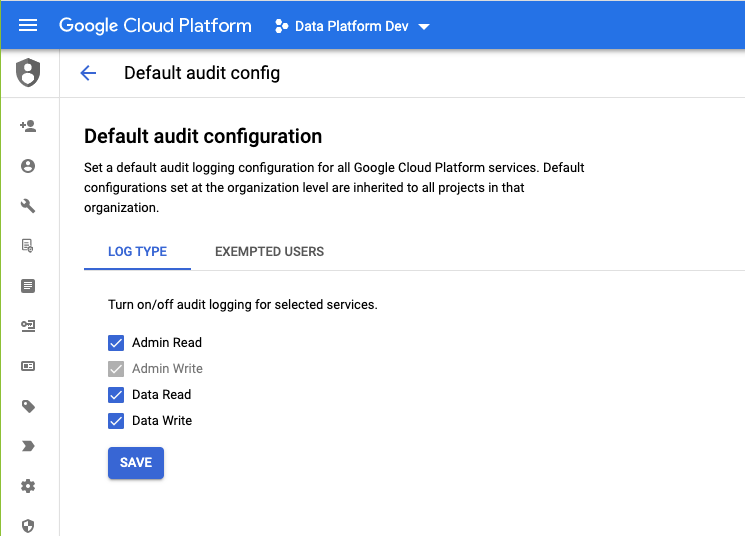

# Data Product Service Prerequisites setup guide

The Data product service (DPS) enables you to easily onboard data to Thoughtworks’ Data Platform. Data pipelines are set up easily with this self-service application. 

It reduces the effort and time from weeks to days. this service will support you in creating and maintaining data products based on the configurations provided.

Refer to the [Data Product Service User Guide v3.0.0](https://docs.google.com/document/d/1SCilUuhdmnoZDz4s_pgXKcSiyN8KuQzlJlt5yX5VF1A) for more information.

However, to effectively use a self-serve data platform, users must have certain prerequisites in place. This guide provides a simple overview of the key prerequisites for creating data products via a self-serve data platform.

## Prerequisites

_**Note** : If you are a new team, please follow **all the below steps** to create a new GCP project and set up the prerequisites for data product creation. If your team has already used Data Product Service, you only need to follow the **steps 9 to 18**._

1. Refer [here](GCP%20Project%20setup.md) to create new GCP projects or map any existing GCP projects for maintaining the data products.


2. Enable audit logs with Admin Read, Admin Write, Data Read, Data Write in default audit configuration, so that it will be enabled for all services

   


3. Create default network using the command  `gcloud compute networks create default` in gcloud console


4. Enable the following APIs in your GCP project by visting corresponding pages
   - Composer API 
   - Bigquery API 
   - Secret Manager API 
   - Cloud run API ( For Events Only )
   - Dataplex API ( For discoverability )


5. Create google groups for the team, to collaborate and communicate with platform or other teams. Refer [here](https://docs.google.com/document/d/1gUEEfJv3Cf3Fm2PI5KehHqz38Yorcwm_vSWnPRl-tPA/edit#heading=h.x0da5xjqjxvx)


6. **[Task for Data Platform]** Add Essential Contacts for the GCP project, add their TL as owners


7. **[Task for Data Platform]** Update the project details in the [Data Platform Master Metadata sheet](https://docs.google.com/spreadsheets/d/1PGATOdSCyNMEZ5maDSKLptEIXpWIxJcTdIIFcktlrTU/edit#gid=1645119921)


8. **[Task for Data Platform]** Add the project into the existing SCC Findings filter for dev, preprod and prod and update the URL in [Data Platform Master Metadata sheet](https://docs.google.com/spreadsheets/d/1PGATOdSCyNMEZ5maDSKLptEIXpWIxJcTdIIFcktlrTU/edit#gid=1645119921)


9. Create custom role [Data Pipeline Runtime](./roles/data_pipeline_runtime.yaml)


10. Create service account - need team name from the user (Service account allows only 30 characters, `{team_name}-dp@{project_id}.iam.gserviceaccount.com`. Use the below snippet to generate the service account ID from your team name and GCP project ID

```shell
function runtime_service_account() {
   local team_name="$1"
   local project_id="$2"
   
   team_name=${team_name:0:27}
   team_name=${team_name%-} #removing trailing hypens
   team_name=${team_name#-} #removing leading hypens
   
   runtime_service_account="${team_name}-dp@${project_id}.iam.gserviceaccount.com"
   
   echo "$runtime_service_account"
}

TEAM_NAME='your-team-name';
PROJECT_ID='your-gcp-project-id';

runtime_service_account $TEAM_NAME $PROJECT_ID
```

11. Attach the custom role [Data Pipeline Runtime](./roles/data_pipeline_runtime.yaml) and GCP provided default role **Cloud Run Invoker** (only for events) to the created service account


12. **[Task for Data Platform]** Add `{team_name}-dp@{project_id}.iam.gserviceaccount.com` to data Products Artifacts Consumer google group.

13. Create custom roles [Data Product Infra Manager](./roles/data_product_infra_manager.yaml) and [DataQualityTask](./roles/data_quality_permissions.yaml)


14. Add the service account data-product-infra-management@tw-data-platform.iam.gserviceaccount.com to IAM in your(domain team) GCP project and attach the custom roles **Data Product Infra Manager** and **DataQualityTask**


15. **[Task for Data Platform]** Add **Data Quality Task For Domain Runtime in Data Platform** to `{team_name}-dp@{project_id}.iam.gserviceaccount.com` in platform gcp project  

for more information refer table 


16. Create two Secrets for storing client id and client secret if the mode is of **API**

**Naming conventions:**

**For Client ID** : `{env}_{data_product_name}_{pipeline_name}_{version}_api_platform_client_id`

**For Client Secret** : `{env}_{data_product_name}_{pipeline_name}_{version}_api_platform_client_secret`


17. Create two secrets as follows for storing client id and client secret for data quality notification.

_**Note**: Please ensure that `email.send` scope is enabled for the consumer app for Notification Service API._

**For Client ID** : `data_product_notifications_client_id`

**For Client Secret** : `data_product_notifications_client_secret`


18. **[Task for Data Platform]** Add the project ids, env and neo team id in the prod spreadsheet as well in dev spreadsheet for mapping the teams and thier projects owned by them

Refer the [Data Platform Service User Guide](https://docs.google.com/document/d/1SCilUuhdmnoZDz4s_pgXKcSiyN8KuQzlJlt5yX5VF1A) for more details
